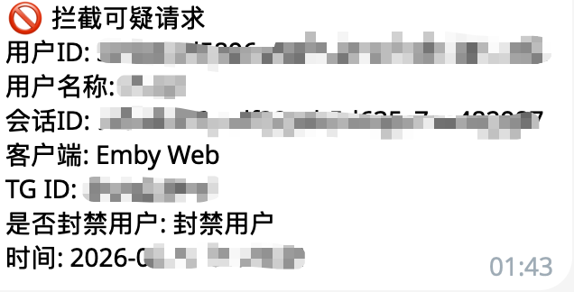

# 内置 API

Sakura_embyboss 内置了一个 FastAPI 服务，用来接收 Emby WebHook、线路上报、播放列表拦截请求，也可以给第三方工具提供用户信息接口。

## 开启方式

在 `config.json` 中确认 `api` 配置：

```json
{
  "api": {
    "status": true,
    "http_url": "0.0.0.0",
    "http_port": 8838,
    "allow_origins": ["*"]
  }
}
```

- `status`: 是否启动内置 HTTP 服务。
- `http_url`: 监听地址，容器 host 网络下一般保持 `0.0.0.0`。
- `http_port`: 默认 `8838`。
- `allow_origins`: CORS 来源，公网暴露时建议改成自己的域名。

!!!warning "安全提醒"

    API 默认以 `bot_token` 作为 query token 进行鉴权，例如 `?token=你的bot_token`。请不要把 `8838` 端口无保护地暴露到公网，建议只允许 Emby、Nginx 或内网访问。

## Emby WebHook 接口速查

WebHook 的 Emby 后台图文配置已经写在 [Helper - WebHook](Helper.md#-webhook---追剧推送)，这里仅保留接口速查，避免两处文档重复维护。

| 接口 | 用途 | 配置说明 |
| --- | --- | --- |
| `POST /emby/webhook/favorites?token=你的bot_token` | 收藏、取消收藏推送 | [追剧推送](Helper.md#-webhook---追剧推送) |
| `POST /emby/webhook/medias?token=你的bot_token` | 新媒体入库推送 | [追剧推送](Helper.md#-webhook---追剧推送) |
| `POST /emby/webhook/client-filter?token=你的bot_token` | 客户端过滤 | [客户端过滤](Helper.md#-webhook---客户端过滤) |

## 线路上报接口

```text
GET /emby/line_report
```

此接口用于 Nginx mirror 上报用户当前访问的线路，再由 Bot 判断普通用户是否误用白名单线路。详细配置见 [白名单线路与 Nginx 上报](line_filter.md)。

常见参数：

| 参数 | 说明 |
| --- | --- |
| `userId` | Emby 用户 ID |
| `line` | 线路标识 |
| `host` | 用户访问的域名 |
| `deviceId` | 设备 ID |
| `sessionId` | Emby 会话 ID |
| `playSessionId` | 播放会话 ID |

!!!warning

    当前线路上报接口主要给反代内部调用，建议只允许 Nginx 本机或内网访问。

## 用户接口

以下接口挂载在 `/user` 下，需要携带 `?token=你的bot_token`。

### 查询用户信息

```text
GET /user/user_info?tg=用户TGID&token=你的bot_token
```

返回用户的 TG ID、积分、Emby 用户名、Emby ID、等级、创建时间、到期时间等。

### 修改用户积分

```text
POST /user/update_credit?token=你的bot_token
```

请求体：

```json
{
  "tg": "用户TGID",
  "credit": 100
}
```

`credit` 可以为正数或负数，负数会扣除积分。

### 封禁用户

```text
POST /user/ban?token=你的bot_token
```

请求体：

```json
{
  "query": "TGID 或 Emby 用户名或 EmbyID"
}
```

执行后会调用 Emby API 禁用账号，并更新 Bot 数据库中的用户等级。

## 认证接口

### Emby 用户登录校验

```text
POST /auth/login?token=你的bot_token
```

请求体：

```json
{
  "username": "emby用户名",
  "password": "emby密码"
}
```

成功时返回：

```json
{
  "code": 200,
  "message": "登录成功",
  "data": {
    "embyid": "用户EmbyID",
    "username": "emby用户名"
  }
}
```

## 播放列表拦截接口

```text
GET /emby/ban_playlist?eid=Emby用户ID
```

用于收到敏感播放列表操作后禁用对应 Emby 用户。此接口风险较高，建议只给可信服务或反代内网调用。

### 效果图

{height=300px width=300px}
