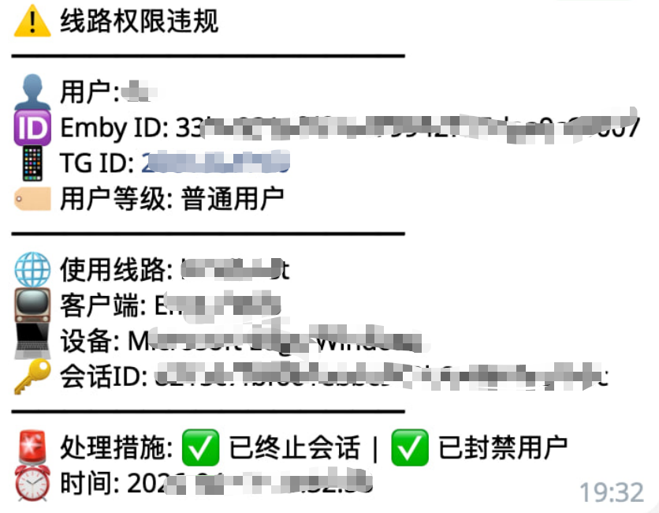

# 白名单线路、线路上报与播放列表拦截

白名单线路用于限制高权限线路只给白名单用户使用。普通用户如果通过反代访问白名单线路，Bot 可以记录、终止播放，或直接封禁。

本页说明 Nginx 反代配置中两项可选能力：

- **线路上报**：播放请求照常转发给 Emby，同时由 Nginx 通过 mirror 异步上报给 Bot 的 `/emby/line_report`。
- **播放列表拦截**：用户创建、修改、删除播放列表时，请求不再交给 Emby，而是由 Nginx 内部转发到 Bot 的 `/emby/ban_playlist`。

完整示例可参考：

- [nginx/nginx.conf](https://github.com/berry8838/Sakura_embyboss/blob/master/nginx/nginx.conf)
- [caddy/caddyfile](https://github.com/berry8838/Sakura_embyboss/blob/master/caddy/caddyfile)

## Bot 配置项

```json
{
  "emby_whitelist_line": "https://vip.example.com",
  "line_filter_terminate_session": true,
  "line_filter_block_user": false
}
```

| 字段 | 说明 |
| --- | --- |
| `emby_whitelist_line` | 白名单用户专属线路，白名单用户可通过点击服务器查看此线路，普通用户无法查看。例如 `https://vip.example.com`。 |
| `line_filter_terminate_session` | 普通用户使用白名单线路时是否终止播放。 |
| `line_filter_block_user` | 普通用户使用白名单线路时是否封禁用户。 |

!!!warning

    建议先只开启 `line_filter_terminate_session`，确认无误判后再考虑开启 `line_filter_block_user`。

## Nginx 需要修改的位置

使用示例配置前，请明白你在改什么。

### 1. Emby 后端地址

```nginx
upstream emby_backend {
    server 127.0.0.1:8096;
}
```

如果 Emby 不在本机，改成实际地址，例如：

```nginx
server 192.168.1.10:8096;
```

### 2. Bot API 地址

```nginx
upstream bot_api_backend {
    server 127.0.0.1:8838;
}
```

如果 Bot 不在本机，改成 Bot API 实际地址。

### 3. 当前线路域名

```nginx
server_name vip.example.com;
```

这是用户实际访问当前线路时使用的域名。Bot 会收到 `host=$server_name`。

### 4. 当前线路标识

```nginx
set $line_name "vip";
```

这是上报给 Bot 的线路名。多条线路时，每个 server 块建议使用不同值，例如 `line_a`、`line_b`、`vip`、`internal`。

### 5. Bot 配置文件

仅修改 Nginx 不够，还需要在 Bot 的 `config.json` 中配置：

```json
{
  "emby_whitelist_line": "vip.example.com"
}
```

这个值需要能和 Nginx 上报给 Bot 的 `host` 或 `line` 对上。通常建议填当前线路的域名。

## 线路上报

### 工作方式

1. 用户请求白名单线路。
2. 原始播放请求正常转发给 Emby。
3. Nginx 额外发一个 mirror 子请求到内部地址 `/internal_line_report`。
4. `/internal_line_report` 把 `line`、`host`、原始请求 URI 和 Emby 认证头转发到 Bot 的 `/emby/line_report`。
5. Bot 从参数、Header 或当前 Emby Sessions 中识别用户。
6. Bot 判断用户是否有权限使用当前线路。

### Nginx 关键配置

```nginx
location ~* ^/emby/Sessions/Playing {
    mirror /internal_line_report;
    mirror_request_body off;

    proxy_pass http://emby_backend;
    proxy_http_version 1.1;
    proxy_set_header Host $host;
    proxy_set_header X-Real-IP $remote_addr;
    proxy_set_header X-Forwarded-For $proxy_add_x_forwarded_for;
    proxy_set_header X-Forwarded-Proto $scheme;
    proxy_set_header Connection "";
}

location = /internal_line_report {
    internal;
    proxy_method GET;
    proxy_pass_request_body off;
    proxy_set_header Content-Length "";

    proxy_set_header X-Original-URI $request_uri;
    proxy_set_header X-Emby-Authorization $http_x_emby_authorization;
    proxy_set_header X-Emby-Token $http_x_emby_token;

    proxy_pass http://bot_api_backend/emby/line_report?line=$line_name&host=$server_name;
}
```

这里选择 `^/emby/Sessions/Playing` 是因为 Emby Web 播放进度常见路径是 `/emby/Sessions/Playing/Progress`。如果你的客户端路径不同，可以在完整配置基础上补充匹配规则。

### 处理结果

Bot 判断普通用户使用白名单线路时，可以按配置执行：

- 仅记录。
- 终止当前播放会话。
- 封禁 Emby 用户并更新 Bot 数据库等级。

## 播放列表拦截

播放列表拦截用于处理用户创建、添加、删除、移动播放列表条目的请求。

### 工作方式

1. 用户请求 `/emby/Playlists...` 相关接口。
2. Nginx 判断命中敏感方法，例如 `POST` 或 `DELETE`。
3. Nginx `return 418`。
4. `error_page 418 = @ban_playlist_block` 将请求内部跳转到拦截处理器。
5. Nginx 转发到 Bot 的 `/emby/ban_playlist?eid=$arg_userId`。
6. Bot 根据 `eid` 执行封禁和通知逻辑。

这样做不会把客户端 301 重定向到 Bot 地址，封禁逻辑只在服务器内部发生。

### Nginx 关键配置

```nginx
location @ban_playlist_block {
    internal;
    proxy_method GET;
    proxy_pass_request_body off;
    proxy_set_header Content-Length "";
    proxy_set_header Host $host;

    proxy_pass http://bot_api_backend/emby/ban_playlist?eid=$arg_userId;
}
```

创建播放列表：

```nginx
location ~* ^/emby/Playlists$ {
    error_page 418 = @ban_playlist_block;

    if ($request_method = POST) {
        return 418;
    }

    proxy_pass http://emby_backend;
    proxy_http_version 1.1;
    proxy_set_header Host $host;
}
```

添加条目到播放列表，并把 GET 查看结果伪装成空列表：

```nginx
location ~ ^/emby/Playlists/(\w+)/Items$ {
    default_type application/json;
    error_page 418 = @ban_playlist_block;

    if ($request_method = POST) {
        return 418;
    }

    if ($request_method = GET) {
        return 200 '{"Items":[],"TotalRecordCount":0}';
    }

    proxy_pass http://emby_backend;
    proxy_http_version 1.1;
    proxy_set_header Host $host;
}
```

删除播放列表条目：

```nginx
location ~ ^/emby/Playlists/(\w+)/Items/(\w+)$ {
    error_page 418 = @ban_playlist_block;

    if ($request_method = DELETE) {
        return 418;
    }

    proxy_pass http://emby_backend;
    proxy_http_version 1.1;
    proxy_set_header Host $host;
}
```

移动播放列表条目：

```nginx
location ~ ^/emby/Playlists/(\w+)/Items/(\w+)/Move/(\w+)$ {
    error_page 418 = @ban_playlist_block;

    if ($request_method = POST) {
        return 418;
    }

    proxy_pass http://emby_backend;
    proxy_http_version 1.1;
    proxy_set_header Host $host;
}
```

!!!note

    如果只想拦截“添加播放列表条目”，不想屏蔽“查看播放列表条目”，可以删除 `GET` 返回空列表的分支。

## 多线路配置

如果有多条线路，通常复制整段 `server { ... }`，每条线路一份，然后分别修改：

1. `listen` / SSL 证书。
2. `server_name`。
3. `set $line_name`。
4. 日志路径。
5. 当前线路是否启用播放列表拦截。

Bot 会根据每个 server 块上报的 `line` 和 `host` 区分线路。

## Caddy 示例

如果你使用 Caddy，可以参考官方示例 [caddy/caddyfile](https://github.com/berry8838/Sakura_embyboss/blob/master/caddy/caddyfile)。

Caddy 示例中的关键点：

- 使用 `forward_auth` 调用 `/emby/line_report`，相当于同步上报线路信息。
- 使用 matcher 匹配 `/emby/Playlists...` 相关请求。
- 使用 `redir` 将播放列表敏感请求转到 `/emby/ban_playlist?eid={query.userId}`。
- 使用 `respond '{"Items":[],"TotalRecordCount":0}' 200` 伪装空播放列表。

## 测试

可以先测试 Bot API 是否响应：

```text
http://Bot地址:8838/emby/line_report?line=vip&host=vip.example.com&userId=Emby用户ID
```

常见返回状态：

- `allowed`: 允许使用当前线路。
- `blocked`: 检测到普通用户使用白名单线路，并已按配置处理。
- `ignored`: 没识别到用户。
- `skipped`: 未配置 `emby_whitelist_line`。

建议先在测试线路验证，不要直接在正式线路启用封禁。

## 效果图

{height=300px width=300px}
{height=300px width=300px}

## 排查

### 一直返回 skipped

说明没有配置 `emby_whitelist_line`，或 Bot 没读取到最新配置。修改配置后重启 Bot。

### 一直返回 ignored

说明 Bot 没识别到用户。检查 Nginx 是否正确传递：

- `X-Original-URI`
- `X-Emby-Authorization`
- `X-Emby-Token`

### 没有终止播放

检查：

- `line_filter_terminate_session` 是否为 `true`。
- Emby API key 是否有效。
- Bot 日志里是否有 session 匹配失败。

### 播放列表拦截没触发

检查：

- 请求路径是否命中 `/emby/Playlists...`。
- 请求是否带有 `userId` 参数。
- `error_page 418 = @ban_playlist_block` 是否存在。
- `bot_api_backend` 是否能从 Nginx 机器访问。

### 用户仍能看到播放列表内容

如果你希望彻底隐藏播放列表条目，确认保留了 GET 空列表分支：

```nginx
if ($request_method = GET) {
    return 200 '{"Items":[],"TotalRecordCount":0}';
}
```
